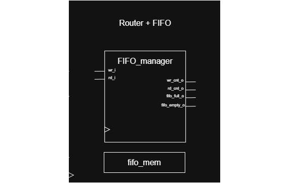

# 4-Channel Output Router with FIFO Buffer

## 📌 Project Overview
This project features the design and verification of a digital **Router with an integrated FIFO buffer**. Developed at **Transilvania University of Brașov**, Faculty of Electrical Engineering and Computer Science, the module handles a single input data stream and routes packets to one of four output channels based on an embedded address.

### Key Features
* **Single Input Stream:** Accepts packets encoded as `[address | data]`.
* **Parametric FIFO Buffer:** Temporarily stores packets to decouple the source from consumers.
* **Automatic Routing:** Directs packets to 4 output channels based on the packet's address field.
* **Valid/Ready Handshake:** Implements a flow control protocol on both input and output channels.
* **Simultaneous R/W:** Supports writing a new packet and reading one in the same clock cycle.
* **Asynchronous Reset:** Ensures a safe initial state (empty FIFO, reset pointers).

---

## 🏗️ Block Diagram
The following diagram illustrates the internal structure, including the `FIFO_manager`, `fifo_mem`, and the routing logic.

---

## 🔌 Interface Specifications

### Input Interface
| Signal Name | Width | Direction | Description |
| :--- | :---: | :---: | :--- |
| **clk_i** | 1 | Input | Clock signal for synchronization. |
| **rst_ni** | 1 | Input | Asynchronous active-low reset. |
| **valid_i** | 1 | Input | Indicates that `data_i` contains a valid packet. |
| **data_i** | 10 | Input | Input packet structured as `[ADDR | DATA]`. |
| **ready_o** | 1 | Output | Indicates the DUT is ready to accept data (FIFO not full). |

### Output Interface
| Signal Name | Width | Direction | Description |
| :--- | :---: | :---: | :--- |
| **valid_o[3:0]** | 4 | Output | Valid signal vector for each output channel. |
| **data_o[31:0]** | 32 | Output | Data payloads for the 4 output channels (8 bits each). |
| **ready_i[3:0]** | 4 | Input | Ready signals from external consumers. |

---

## ⚙️ Functional Description

### FIFO Manager
The `fifo_manager` is responsible for:
* **Element Tracking:** Monitoring the current number of items (`no_of_elements`).
* **Pointer Management:** Handling circular write (`wr_cnt_o`) and read (`rd_cnt_o`) pointers.
* **Status Flags:** Generating `fifo_full_o` and `fifo_empty_o` to prevent overflow and underflow.

### Routing Logic
1.  **Packet Analysis:** The router checks the packet at the top of the FIFO.
2.  **Address Extraction:** It extracts the `head_addr` to determine the destination channel (0–3).
3.  **Targeting:** It activates the specific `valid_o` bit and places the payload on the corresponding channel.
4.  **Handshake Completion:** The packet is only removed from the FIFO when the selected channel signals `ready_i = 1`.

---

## 📈 Verification & Waveforms
The design has been verified through simulation covering critical scenarios:
* **FIFO Full Handling:** The system correctly asserts `fifo_full_o` and de-asserts `ready_o` when reaching capacity.
* **Backpressure Test:** Demonstrated that the router holds packets in the FIFO until the consumer is ready.
* **Dynamic Routing:** Verified that packets are correctly steered (e.g., packet `0a1` to Channel 0, `1b2` to Channel 1).

---

## 🎓 Author
* **Grigore Mihai-Alexandru** 
* **Academic Year:** 2025 - 2026 
* **Institution:** Transilvania University of Brașov 